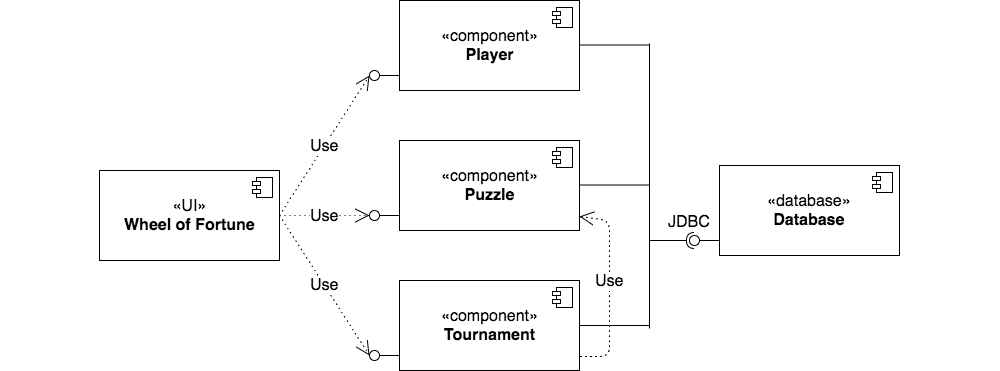
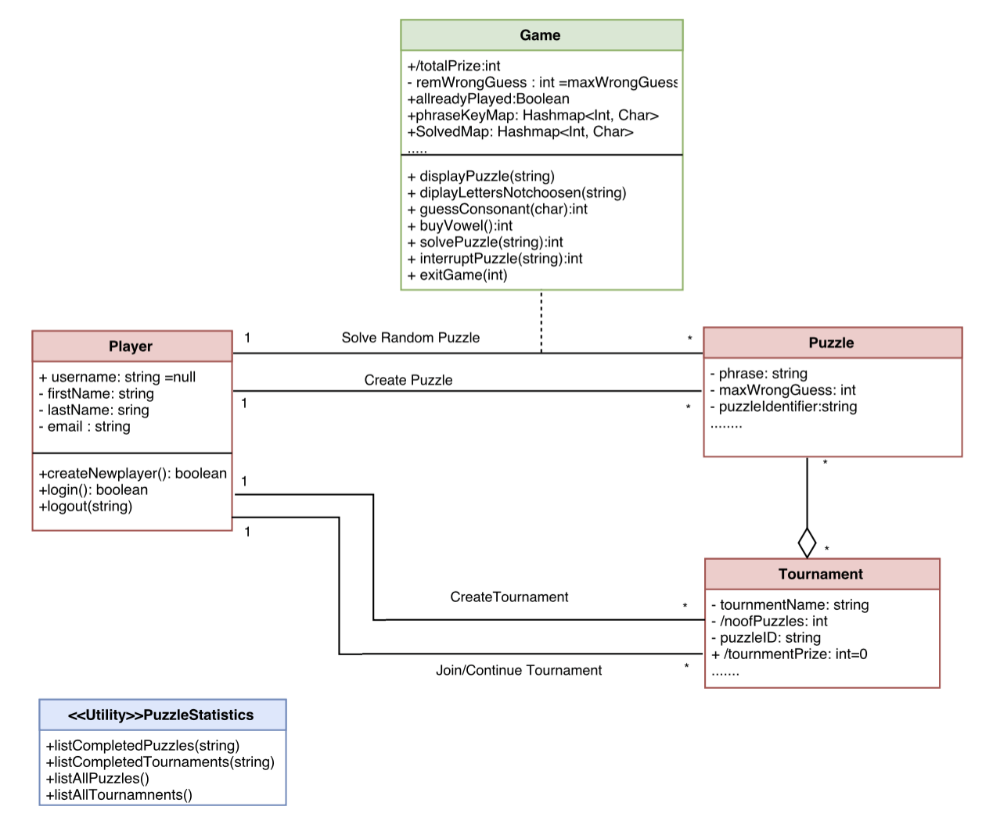
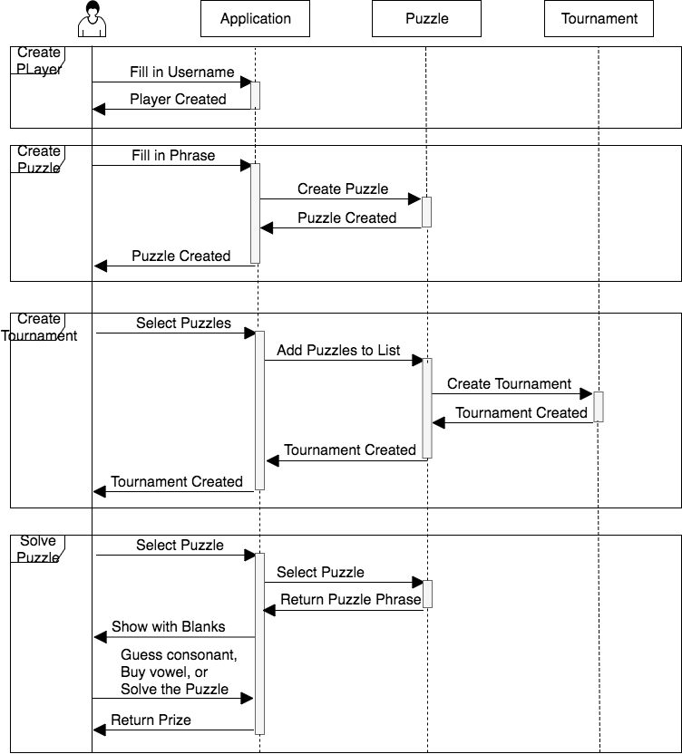

# Word Guessing Game

## 1 Design Considerations

### 1.1 Assumptions

- The application only runs locally, and only players on the same device are able to share information. 
- There is no need to consider authentication or security requirements. A unique username is sufficient enough for logging in. If the user forgets his username, he needs to create a new player account to run the application. 
- Android phones satisfying the minimum operating system requirement (Android 4.4) is available to run the application. 
- The users are granted storage permission to the system when they use the application. 
- Temporary lost of game process due to forced crash are not recovered. 

### 1.2 Constraints

- The system will be developed using Java, Android Studio, and free open source libraries.
- The system must run on an Android phone with Android 4.4 and higher version OS installed.
- The system UI language will be shown in English only. The puzzles will only have English phrases.
- As limited budget, the system will only be tested on Android Virtual Devices (AVDs) created in Android Studio.

## 2 Architectural Design

### 2.1 Component Diagram

### 2.2 Deployment Diagram

## 3 Low-Level Design

### 3.1 Class Diagram

### 3.2 Sequence Diagrams

## 4 User Interface Design

### 4.1 User Login Interface

- Input field for the user to enter username
- Login button, if clicked, login with the entered username
- Create New Player button, if clicked, show the Create New Player Interface. 

### 4.2 Create New Player Interface

- Input fields to enter first name, last name, username, and email. 
- Submit button, if clicked, insert the input information to the User table in the database. 

### 4.3 Main Menu

- Create Puzzle button, if clicked, show the Create Puzzle Interface. 
- Create Tournament button, if clicked, show the Create Tournament Interface. 
- Solve Puzzle button, if clicked, show the Solve Puzzle Interface. 
- Join Tournament button, if clicked, show the Join Tournament Interface. 
- View Statistics button, if clicked, show the View Statistics Interface. 

### 4.4 Create Puzzle Interface

- Input field to enter phrase and the maximum number of allowed wrong guesses. 
- Submit button, if clicked, insert the input information to the Puzzle table in the database. 

### 4.5 Create Tournament Interface

- A list of puzzles that the user has either created or already played. The user can select 1-5 puzzles from the list. 
- Input field to enter name. 
- Submit button, if clicked, insert the input information to the Tournament table in the database.

### 4.6 Solve Puzzle Interface

- Showing the puzzle phrase with blanks for alphabetic characters. 
- Showing the left number of wrong guesses. 
- Input field of Guess Consonants and Submit button. 
- Input field of Buy Vowel and Submit button. 
- Solve Puzzle button. 

### 4.7 Join Tournament Interface

- Show the list of the puzzles and the solved/unsolved status
- If any puzzle is clicked, show the Solve Puzzle Interface. 

### 4.8 View Statistics Interface

- Show the list of puzzles played by the player and the prizes. 
- Show the list of tournaments played by the player and the prizes. 
- Show the complete list of puzzles with winners and prizes.
- Show the complete list of tournaments with winners and prizes. 
 
